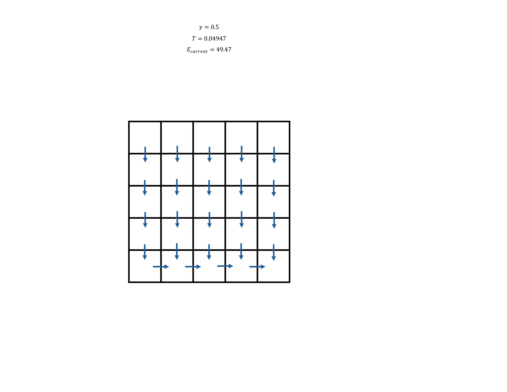

# Writing PyOCN: A Library for Generating Simulated River Networks
I recently took a shot at building an actual software library, something I haven't really done before. I've made loads of scripts and one-off software projects for my own use or for research use, but never something meant to be distributed to the public. It turned into a substantial learning experience for me. I had to sharpen my C programming skills, learn how foreign function interfaces work, understand how software libraries are structured, and figure out how to distribute a Python package publicly.

The result of my work is `PyOCN`: a collection of tools for working with Optimal Channel Networks (OCNs) inspired by the `OCNet` R package developed in Carraro et al. (2020), *Generation and application of river network analogues for use in ecology and evolution. Ecology and Evolution.* doi:10.1002/ece3.6479. It mirrors some of the functionality of the OCNet R package (https://lucarraro.github.io/OCNet/), but implemented in python and C, and with some substantial performance improvements.

I first used OCNs in 2024 during a project as an intern at Oak Ridge National Lab. I liked the elegance of the algorithm but found the OCNet R package limiting: many hydroligists prefer to work in python over R, and the OCNet R package had some substantial performance and dependency issues. I tried rewriting the algorithm in Python, but it was painfully slow: roughly 30 minutes to generate a 64×64 grid that OCNet handles in seconds. Digging through OCNet revealed that it relies heavily on SPArse Matrix (SPAM), a Fortran library, so my pure-Python rewrite was doomed. I tried again in Julia, still without the performance I wanted. Eventually I shelved the project. A few months later, while procrastinating on my PhD thesis, I decided to give it one more shot, this time implementing the entire backend in C and wrapping it with Python bindings.

# How do river networks form?
I want to give a brief overview of how river networks form and are structured in the real world before diving into the specifics of the OCN algorithm. River networks form in drainage basins, or watersheds. A drainage basin is a region of land where all precipitation that falls within it drains to a common outlet, such as a river mouth or lake. The boundaries of a drainage basin are defined by topographic highs, such as ridges or hills, which direct the flow of water downhill towards the outlet. This topographic map of the cirque of the towers in Wyoming shows a very obvious example of a watershed: all the water that falls within the cirque drains east into the North Popo Agie river.

<div align="center">
  
</div>

Like trees, river networks are fractal in nature: in the above map, while all of the water in the cirque eventually ends up in the North Popo Agie river, it gets there by flowing through a series of ever-larger tributaries. Rivers start flowing in headwater streams, which are small channels that might only carry water during and immediately after rain events. These headwater streams converge to form larger streams, which in turn converge to form even larger rivers. This branching structure continues until the water reaches the main river channel, which carries the water to its final destination. You might hear about rivers having a "source:" the Mississippi river, for example, is said to "begin" at Lake Itasca in Minnesota. This might make sense from a political or cultural standpoint, but hydrologically speaking, the "source" of the Mississippi is actually the entire network of hundreds of thousands of tributaries that feed into it, starting from tiny headwater streams across the Midwest, Rocky Mountains, Appalachians, and the South (in fact, the Mississippi River isn't even the largest river in its own drainage basin: the Missouri River, which flows into the Mississippi just north of St. Louis, is longer, and the Ohio River, which flows into the Mississippi near Cairo, Illinois, moves more water each year).

<div align="center">
  
</div>

Why does this branching structure form, though? The answer lies in the interplay between water flow, erosion, and landscape topography. When water flows over the land surface, it exerts a force on the soil and rock, causing erosion. As it pushes against and erodes the rock, the water in the river channel expends energy. The amount of energy expended in erosion is sometimes called the "power" of the river. Like many things in nature, river networks tend to evolve towards configurations that minimize energy expenditure. This means that rivers will naturally adjust their paths and shapes to reduce the amount of energy they need to transport water and sediment downstream. In OCNs, the two main factors that are assumed to control erosional power (and energy expendature) are discharge (the amount of water flowing through a channel) and channel slope (the steepness of the channel). Higher discharge and steeper slopes lead to more erosional power, which in turn leads to more energy expenditure. Therefore, river networks will tend to evolve towards configurations that balance these two factors in a way that minimizes overall energy expenditure. 

Over time, streams will find paths that minimize energy expenditure. This might happen during a flood event, causing a river network to spill its banks and carve out a new channel or shortcut an oxbow bend. It might also happen gradually over thousands of years as small erosion events slowly change the landscape. The result is a branching network of streams and rivers that efficiently transports water from the landscape to the ocean, while minimizing energy expenditure along the way. OCNs don't capture all of these physical processes, but they do a good job of capturing the large-scale fractal structure of river networks.

A model of a river network that captures these principles can be used to simulate how pollutants, sediments, organisms, or flood events move through landscapes with different river network structures. You may recall the deadly Texas Hill Country flash floods of 2025, which were exacerbated by the region's dense river network structure. Simulating flood events in different river network structures can help us understand how these networks influence flood dynamics, and can inform flood risk management strategies. River network models can also help us deploy optimal sensor networks by maximizing the amount of information we can gather about a watershed with a limited number of sensors.

# OCN basics
OCNs are models of river network structure based on the principle of optimality: river networks evolve to minimize the total energy expenditure of transporting water through the network. A stream with high erosional power will meet resistance from the landscape as it incises its channel. In the case of OCNs, erosional power of a single segment $i$ of a river network is assumed to depend on (1) mean discharge ($Q_i$) and (2) channel slope ($s_i$). Both mean discharge and channel slope are assumed to depend on drained area ($A_i$):

$$
Q_i \propto A_i
$$
$$
s_i \propto A_i^{\gamma - 1}
$$
$$
E_i \propto Q_i s_i \propto A_i^\gamma 
$$

The energy dissapated by the entire river network in aggregate is then given by summing over all segments:

$$
E = \sum_i A_i^\gamma,
$$

Note that the outlet of the river network always contributes the same amount of energy dissapation, since it must always drain the same area (the entire watershed).

OCNs are generated by numerically minimizing this total energy. The parameter $\gamma$ tells the OCN how to weigh the importance of slope vs discharge in the energy budget. $\gamma$ takes values between 0 and 1, with common choices being around 0.5. The value of $\gamma$. In networks with $\gamma \approx 0$, small watersheds are assumed to be the steepest, and dominate the energy budget: the optimal OCN will be dominated by large watersheds. In networks with $\gamma \approx 1$, all watersheds are equally steep, and energy is dissapated evenly across the network: the optimal OCN could have a wide variety of watershed sizes.

To illustrate this, consider the elevation map of the following two extreme OCNs, optimized with $\gamma = 0.99$ (left) and $\gamma = 0.01$ (right). The unique streams in the low-$\gamma$ network are far more tortuous (top right), fewer in number, there are very few headwater catchments (bottom right), and the elevation provile is very flat (never exceeding 4 m in elevation). In contrast, the high-$\gamma$ network has many short, straight streams (top left), a large number of small headwater catchments (bottom left), and grows to almost 170 m in elevation.

<div align="center">
  
</div>

The algorithm for generating an OCN follows a myopic search pattern, that mimics how river networks evolve over time through local erosion events. The basic steps of the algorithm are as follows:

1. Initialize a directed acyclic graph with no crossings that forms a spanning tree over all of the cells in a 2D grid. Each cell drains into one of its 8 immediate neighbors (except the root, which has not outlet). This represents the initial structure of the river network, before optimizing.
2. Choose a random cell in the grid. Propose changing that cell’s outflow to point towards a random, different neighbor (assuming it doesn't break the graph structure). This represents a possible local erosion event.
3. Accept or reject the proposed change based on an acceptance probability. Changes that lower the total energy are always accepted, and changes that raise the total energy are conditionally rejected, based on a "temperature" parameter:

$$
P(\mathrm{accept}) = \min\left(1, \exp\left(-\frac{E_\mathrm{proposed} - E_\mathrm{current}}{T}\right)\right).
$$

$E$ is the total network energy and $T$ is temperature. The lower the temperature (or the greater the increase in energy), the less likely the change is to be accepted. By conditionally accepting sub-optimal changes, we give the algorithm the chance to explore a wider range of possible network configurations. This is similar to the Metropolis Criterion used in other probablilistic optimization algorithms. Temperature is chosen as a free parameter, and is typically made to exponentially decay over time (iterations) based on an "annealing schedule." $T$ starts high to allow the network to explore a wide range of possible configurations, and decreases as the number of iterations increases to make the optimization algorithm more greedy and settle on a low-energy state. 

4. Repeat steps 2 and 3 until convergence ($\Delta E / E < \varepsilon$) is reached or a fixed number of iterations is reached. 


Below is a .gif showing a conceptual example of how the OCN optimization algorithm works over time. The initial network has a simple parallel structure. Over time, local erosion events cause the network to reconfigure itself into a more optimal, dendritic structure.

<div align="center">
  
</div>

Below is an example of running the optimization algorithm with $\gamma = 0.375$ for several million iterations. Blue/green colors indicate low elevation, and brown/white colors indicate high elevation. Since this OCN was optimized with a periodic boundary condition, the boundary of the watershed can change over time as flowpaths "jump" across the the boundary. I think it's quite beautiful, like an amoeba squirming around under a microscope.

<div align="center">
  
</div>

More information on OCNs and network scaling dynamics can be found in:

Rinaldo, A., Rigon, R., Banavar, J.R., Maritan, A., Rodriguez-Iturbe, I. (2014). *Evolution and selection of river networks: Statics, dynamics, and complexity*. PNAS 111(7), pp 2417-2424. doi:10.1073/pnas.1322700111

# Algorithm implementations
Aside from the high-level description of the OCN algorithm given above, there are other considerations that must be made as well:

* How should the network be represented in memory?
* How should we check the validity of a network after changing it? (i.e. does the network contain cycles or edge crossings?)
* How should we update the drained areas of each vertex in the network after making a change?
* How should we compute the energy of the network after making a change?
* How should we handle undoing changes that are rejected?

The most popular existing implementation of the OCN algorithm is the `OCNet` R package developed by Carraro et al. (2020). This implementation uses a matrix representation of the flow network. The implementation is rather elegant, but I found it difficult to follow at first. Therefore I'll talk about my implementation (in `PyOCN`) of the OCN algorithm, and then I'll compare it to the `OCNet` approach. 

## The PyOCN implementation
I will go more in-depth into the specifics of my implementation in `PyOCN`, since it's less documented elsewhere, but here is an overview.

In `PyOCN`, the network is represented directly as a directed acyclic graph (DAG), encoded as an array of vertices, where each vertex has attributes indicating which neighbors it connect to which vertex it drains towards. Rerouting the outflow of a given vertex involves changin it and it's neighbors' attributes to reflect any desired new connections (and the loss of any old connections). 

To check for cycles after making a change to the network, `PyOCN` iteratively traces a path downstream from both the new and old downstream neighbors of the affected vertex. If the same vertex is ever encountered twice, we know that a cycle was created.

We must also check for crossed edges. In grid where edges only connect adjacent vertices, crossed edges can occur if two adjacent vertices drain diagonally (e.g. a vertex at positiong `x=5`, `y=5` drains SE into `x=6`, `y=6`, while the vertex at `x=6`, `y=5` drains SW into `x=5`, `y=6`). To check for crossed edges, we first check that the proposed new outflow direction is diagonal. If it is, we then check the outflow direction of the two adjacent vertices in the orthogonal direction. If either of those vertices have outflows that connect diagonally in a "shared direction" with the proposed diagonal outflow, then these is a crossed edge (e.g. if the proposed edge drains SE, we check the cell to the S. If it has a NE edge, then a cross is detected. Likewise if the nieghbor to the E has a SW edge, then a cross is detected). 

If either a cycle or a cross is detected, then we undo the proposed change and try again until a valid change is found. Once a change is found to be valid, we must then update the drained area of each vertex in the network. A re-route does not change the drained area of all the vertices in the network, only those downstream of the source vertex. Therefore, we can efficiently update drained areas by traversing the graph starting from the source vertex and propagating changes downstream. If a change is made close to the outlet, only a few vertices need to be updated, even if the network is very large. We can update the energy of the network in the same way. This change is then accepted or rejected based on the Metropolis criterion (step 3 of the algorithm). If the change is rejected, we must undo everything: first by undoing are area and energy updates, and then by restoring the original outflow of the affected vertex and its neighbors. This concludes one iteration of the algorithm.

A typical number of iterations for convergence is on the order of `40N`, where `N` is the number of vertices in the network.

## The OCNet implementation
The implementation in `OCNet` is more abstract. In `OCNet`, the network is represented as a sparse adjacency matrix $\mathbf{W}$, where each entry $W_{ij}$ indicates whether cell $i$ drains into cell $j$ ($\mathbf{W}_{ij}$ = 1) or not ($\mathbf{W}_{ij}$ = 0). To reroute a vertex's outflow, the adjacency matrix is updated manually to reflect any new connections (and the loss of any old connections). 

To check for crossed edges, `OCNet` used the same logic as `PyOCN`. To check for cycles, however, it performs an incremental topological sort on the modified adjacency matrix. A topological sort is an ordering of the vertices in a directed graph such that for every directed edge from vertex $i$ to vertex $j$, $i$ comes before $j$ in the ordering. This places "headwater" vertices before "downstream" vertices. If a cycle exists in the graph, then a topological sort is impossible. Therefore, by attempting a topological sort on the modified adjacency matrix, `OCNet` can efficiently check for cycles. The clever part of this approach is that this topological sorting can be used to speed up the next step in the algorithm: updating drained areas.

To update the drained areas of each vertex in the network, `OCNet` leverages an identity of the adjacency matrix: $(\mathbb{I} - \mathbf{W}^T)\vec A = \vec 1$, where $\vec A$ is the vector of drained areas and $\vec 1$ is a vector of ones. This linear system can be solved for $\vec A$ to yield the drained areas for all cells. To solve this system efficiently, `OCNet` uses the topological ordering obtained from the previous step: the topological ordering permutes the adjacency matrix to be upper triangular. This allows for the linear system to be solved in $O(n)$ time using back-substitution. Finally, the energy of the modified network can be computed using the updated drained areas, and the proposal can be accepted or rejected based on the Metropolis criterion (step 3 of the algorithm). 

## Comparing the two implementations
Here's a diagram comparing the structure of the two approaches. On the left is the DAG approach used in `PyOCN`, and on the right is the adjacency matrix approach used in `OCNet`.

<div align="center">
  
</div>

This diagram roughly shows how the two implementation differ.

<div align="center">
  
</div>

I find the implementation of `PyOCN` more approachable, but it does require more bookkeeping and code to handle traversing the graph and updating drained areas. The `OCNet` approach is certainly more elegant and easier to code (with access to an efficient sparse matrix library like SPAM), but it took me a while to understand how the various pieces fit together. 

Additionally, I believe that the implementation in `PyOCN` has the potential to be much faster than the `OCNet` one, especially for large networks. In `PyOCN`, updating drained areas and energies only requires visiting the affected downstream vertices, which can be a small fraction of the total network. In `OCNet`, however, updating drained areas requires solving a global linear system each iteration, which involves visiting all vertices in the network. While both approaches have a worst-case time complexity of $O(N)$ per iteration, in actuality that $N$ can be much smaller in `PyOCN`, especially if changes are made close to the outlet.

# PyOCN in code
OCNs make for a good first C project: the algorithm is conceptually straightforward but requires careful handling of a nontrivial data structure (a spanning tree over a fixed grid with 0 crossed edges). And because it’s not vectorizable, I can't just shove my code into a bunch of NumPy arrays and expect a significant speed-up.

`OCNet` splits the implementation of the OCN algorithm between R and Fortran: R handles the logic, main optimization loop, and user interface, while Fortran handles the computationally intensive sparse matrix manipulations. In `PyOCN`, I decided to implement everything in C (except for the user interface), which I compiled into a shared library, `libocn`, that could be called from Python.

As I mentioned in the previous section, in `libocn`, I represent the flow network as a DAG encoded as a flat array of `Vertex` structs. Each `Vertex` represents a single grid cell and contains fields for drained area, outflow direction, and a bitmask indicating which of its 8 neighbors it has connections to:

```c
typedef struct {
    double area;    // Cumulative drained area
    char edges;     // Bitmask of connected neighbors
    char outflow_direction; // Direction of outflow (0, 1, 2, 4, 8, ..., 64)
    int outflow_index;   // Index of the outflow neighbor (0 through N-1)
    bool is_visited;    // Helper field for traversals
} Vertex;
```
The `edges` field is an 8-bit bitmask where each bit indicates whether the vertex has a connection to that neighbor: bit 0 for N, bit 1 for NE, etc. For example, if `edges = 00010011` (19), then that vertex connnects to its N, NE, and S neighbors. The `outflow_direction` field indices which neighbor the vertex drains into, encoded as a power of two (1 for N, 2 for NE, 4 for E, etc). To find which edge the vertex uses as an outflow, we can perform the bitwise operation `(1 << outflow_direction) & edges == 0` to check which neighbor it drains into. This encoding allows for very compact storage of the network structure, and the bitwise operations are very fast to compute. Compared to a more conventional method of storing the neighbor indices directly (which would require 4 bytes per neighbor, adding up to 32 bytes per vertex), this approach uses only 1 byte to store the `edges` bitmask and 1 byte to store the `outflow_direction`, for a total of 2 bytes per vertex. However, each vertex must also stores it drained area, which takes up 8 bytes (a double-precision float). Due to structure padding, this that the total size of each `Vertex` struct is 16 bytes (8 + 1 + 1 + 6 bytes of padding). To not waste the 4 bytes of padding, I added in the `outflow_index` field, which stores the index of the outflow neighbor in a flat array of vertices without sacrificing memory. I also added the `is_visited` field, which is used to check for cycles. This field is useful for traversing the graph efficiently without having to recompute neighbor indices from the bitmask each time. 

The full grid of vertices is stored in a `FlowGrid` structure:

```c
typedef struct {
    int nrows;
    int ncols;
    Vertex *grid;
    double total_energy;
} FlowGrid;
```

The `grid` field points to a flat array of `Vertex` structs of size `nrows * ncols`, which is indexed in row-major order. I tested several block-tiling layouts as a way to further improve cache locality, but it didn't seem to provide any meaningful benefits, at the cost of much more difficult debugging.

## CHECKING FOR CYCLES
## COMPUTING UPDATES AREAS AND ENERGIES

# PyOCN
I compiled the backend into a shared library, `libocn.so`, and interfaced with it using Python’s `ctypes` library to create the `PyOCN` package. Apparently, I could have actually built `libocn` as a native Python extension module using the `PyModule` C API, which would have allowed for tighter integration with Python. However, that approach requires a lot more boilerplate code to handle converting between Python objects and C structs than I was willing to write for this small project, and likely limits the compatability of `libocn` with languages other than Python. Instead, `ctypes` let me redefine the C header files in Python so it could navigate `libocn` as a foreign library, and then I just built Python functions and classes that wrapped the raw C functions in a user-friendly interface.

The Python side centers on the `OCN` class, which wraps a `FlowGrid` structure and its associated optimization functions, in addition to providing constructors, customizable optimization routines, and various export, visualization, and analysis utilities. For example, you can convert graphs built in the `networkx` package to `OCN` object, export `OCN` objects to `networkx` directed graphs or to raster DEMs, and perform various hydrologic analyses on them such as calculating flow accumulation and stream order.

In PyOCN, you can create and optimize an OCN in just a few lines of code:

```python
import PyOCN as po
import matplotlib.pyplot as plt
# Create an OCN on a 64x64 grid with gamma=0.5, 
# with a periodic boundary condition and "hip-roof" initial structure
ocn = po.OCN.from_net_type("H", dims=(64, 64), 
    gamma=0.5, wrap=True, random_state=8472)
# optimize the OCN
ocn.fit()
# Visualize the resulting DEM
res = ocn.to_xarray()
res.elevation.plot(cmap="terrain")
plt.show()
```

<div align="center">
    
</div>


# Performance comparison
Both of these operations (the DAG approach and the adjacency matrix approach) should have time complexity $O(N)$ in the worst case, where $N$ is the number of cells in the grid. I can't directly compare performance between the two different algorithms since `OCNet` is implemented in R and Fortran, while `PyOCN` is implemented in Python and C. Additionally, `OCNet` only delegates out the most basic backend stuff (like performing the raw sparse matrix operations) to Fortran, whereas `PyOCN` does everything except for the interface in `C`. However, in my tests, my `PyOCN` is much faster than `OCNet`. How much of this is to do with my algorithm and how much of it is to do with my choice of language is impossible to say for now. On an M1 Macbook Pro, `PyOCN` is consistently ~20-60x faster than `OCNet`. They both seem to scale roughly as $O(N)$ in practice, which aligns with my rough complexity computation.

<div align="center">
  
</div>

# Building and distributing
Distributing a Python package with a C backend is not trivial, as it turns out. I had to learn the Python build chain, including how to get `setup.py` to compile the C code automatically. I didn’t want to distribute wheels (a pre-compiled binary Python package) for every platform, and I didn’t want users compiling the code manually, so the `setup.py` route made the most sense.

You can now install `PyOCN` from PyPI with `pip install PyOCN`.

The source code is on GitHub: https://github.com/alextsfox/PyOCN

Documentation is here: https://pyocn.readthedocs.io

# Future Work
Currently, `PyOCN` implements the DAG version of the OCN algorithm. I would like to try implementing the adjacency matrix version as well, to compare performance and code complexity. Right now, `PyOCN` also has some basic export, visualization, and analysis tools: you can export the OCN as a raster DEM or as a graph in `networkx`, but I would like to see some more advanced analysis tools added: stream order calculations, hydrologic unit delineation, and watershed extraction are high on my list.

# Wrapping up
This project was a huge success for me: I learned a lot about C programming, Python packaging, and software design, and I created an alternative implementation of the OCN algorithm that is an order of magnitude faster than the existing library.

`PyOCN` is still a hobby project. If you need well-tested academic software, `OCNet` is likely the more stable choice. But if you want a fast, Python-native way to play with OCNs and simulated river networks, `PyOCN` does the job well (and with love).

If you end up using it for something, I’d genuinely like to hear about it.

Thanks for reading!
