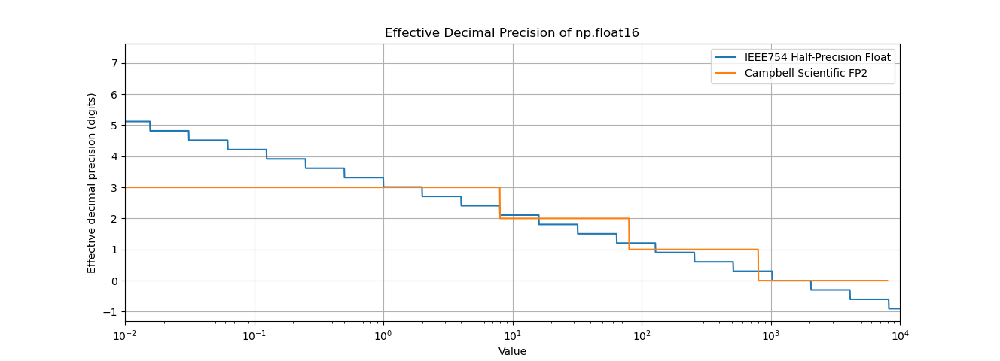

Much of my work in my current post-doc (and all through graduate school) has me working with Campbell Scientific equipment and data loggers. We use them pretty much everywhere, and they're the industry standard for building micrometeorology and eddy covariance platforms. Their dataloggers especially are very reliable and robust to the elements, but they come with a few quirks.

# The Good

In the early 2000s, storage on data cards used in meteorology and eddy covariance systems was severely limited, and data corruption was common (and since most systems have to rely on solar power and sit out in the heat and the snow all year, data corruption is still a major risk). Dataloggers could often store a few MB of data, equating to only hours to a few days of 10 Hz data before filling up. This is less of a problem now, with 32GB+ SD cards available for cheap. As a result, data formats needed to be both space-efficient and robust to partial corruption.

Campbell Scientific addressed this with a bespoke format called TOB (table-oriented binary). TOB files follow a pattern common to many scientific data formats:

1. An ASCII header containing human-readable metadata (column names, logger model and firmware, etc.) along with the information required to parse the binary data.
2. A binary data table composed of fixed-length data frames, each with its own header identifying the starting timestamp of that frame. A table may contain anywhere from a handful to thousands of frames.

This structure supports strong data provenance. Each file is signed by the datalogger, and each data frame is generated and written independently. If a crash or write failure occurs, corruption is typically confined to one or two frames rather than the entire file.

The binary encodings themselves are also carefully chosen. In addition to standard integer and IEEE-754 floating-point types, Campbell uses a proprietary 16-bit floating-point format called FP2. FP2 has a smaller dynamic range than IEEE-754 float16 (±8191), but provides higher precision over the range most common in micrometeorology. For typical air temperatures (−40 to +40 °C), FP2 is often about twice as precise as IEEE-754 float16. Although FP2 never exceeds roughly three decimal digits of precision, this is sufficient to match the noise characteristics of most meteorological sensors.

<div align="center">
  
</div>

These data formats are still commonly used. TOB data files are often several times smaller in size than their ASCII counterparts, and their robustness to data corruption is very desirable.

# The Bad
Unfortunately, there aren't many tools available for parsing this binary TOB files into ASCII formats. This is a proprietary format, so only Campbell Scientific can guarantee the accuracy of any tools used to parse them. The tool that most people use is the free (as in "doesn't cost money") GUI called "CardConvert" that parses TOB files into ASCII (called "TOA5") files, but this tool is old, finicky, buggy, and requires constant attention. Say you have a directory with 1000 separate data files on it, each taking about 30 seconds to process in CardConvert. Every time CardConvert encounters a corrupt file, it stops all operation and makes you click an "okay" box each time, meaning that you must sit at your computer for several hours, clicking on every error message that appears. In the past, I've actually installed an auto-clicker program to click on the spot where the error message pops up every 30 seconds so that I could have the program overnight. Very frustrating stuff. 

# The Ugly 
Campbell distributes two CLI tools, `tob32.exe` (deprecated) and `csidft_convert.exe`, for this purpose, but they're only included with LoggerNet, which costs about &#36;600. Upgrading an existing LoggerNet license is "only" &#36;350. While Campbell Scientific employs many smart, helpful people, and LoggerNet offers valuable utilities for networking with dataloggers, paying &#36;600 for software that is arguably necessary to process files from a datalogger and sensors that I already likely paid them over &#36;10,000 for feels...somewhat offensive.

# The Solution
The solution to this of course is to try to build my own decoder program. 

It turns out that someone has already done this, namely Dr. Mathias Bavay, a modeler from the Swiss avalanche research institute WSL/SLF (and, coincidentally, whose model SNOWPACK I used extensively in my PhD dissertation). The tool, [available on his gitlab](https://gitlabext.wsl.ch/bavay/camp2ascii), is a fantastic resource. However, compiling and using it could be difficult for most users: I had to modify the `makefile` and some of the source code to get it to run on my machine, and some of the functionality doesn't work as described in the help menu. It's quite fast and great for my own workflows, but it's not something I feel comfortable pointing my technicians and collaborators to, due to the difficulty of getting it up and running. 

Instead, I created a python program that's essentially a clone of Mathias' `camp2ascii`. It can be used as a CLI tool to decode binary TOB files, or as a python module that can be easily integrated into an existing workflow. Being written mostly in python (and containing more AI-written code than I'd like to admit), it's not as fast as Mathias' program or CardConvert, but I've found it to be reliable so far. In the future, I'll keep working on it to try to improve its speed. I might also try to just modify Mathias' code directly to make it more easily distributable. 

The program is available on PyPI if you want to use it. You can install it with `pip install "camp2ascii[progress]."

Here's an example using it to read in several files, convert them to ASCII format, and plot them in 30-minute summaries:

```python
import pandas as pd
import matplotlib.pyplot as plt
from camp2ascii import camp2ascii
from pathlib import Path

ascii_files = camp2ascii("./64293_20Hz*.dat", "./ascii_files", pbar=True)

data = pd.concat([
    (
        pd.read_csv(path, na_values="NAN", parse_dates=["TIMESTAMP"], index_col="TIMESTAMP", skiprows=[0, 2, 3])
        .resample("5min")
        .mean()
    )
    for path in ascii_files
])
data = data.sort_index()
data.plot(y="sonic_temp", style='o')

plt.show()
```


